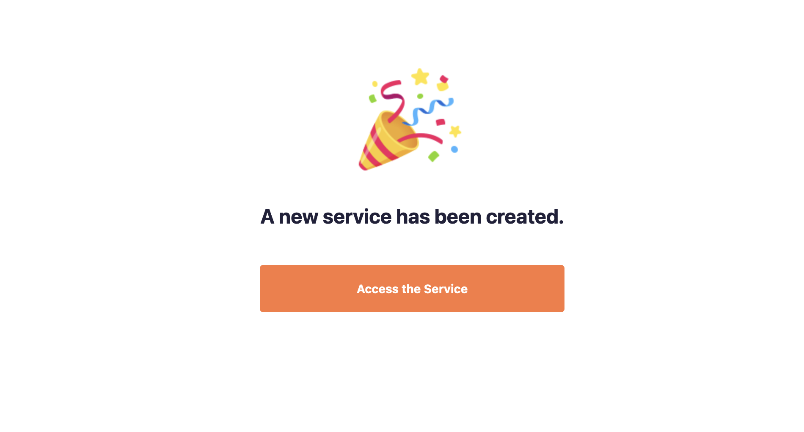

[](https://astro.build)
[](https://react.dev)
[](https://tailwindcss.com/)
[](https://microcms.io/)

# Easy to create a blog
# Tutorial

## 1. Create your account
- ### **[microCMS](https://microcms.io/)** Headless CMS

## 2. Create Service
- ### create your own


## 3. Create New Serveice
- ### Servive Name: Specify the Servive Name.
- ### Service ID:   Specift the Service ID.
 
- ### Done!👍
 

## 4. Create API
- ### create your own
 

## 5. Enter Basic Information
- ### API Name: Difine your API name.
- ### Endpoint: blogs
- ### <Important: Endpoint is **"blogs"**> 
 

## 6. Select API Type
- ### List Format
 

## 7. Define API Schema
- ### Like this


## 8. Create Your Original Content


- ### Press the "Publish" button in the upper right corner.

- # *Congratulations!🎉*

## 9. Move to Your Project Folder And Create .env
- ### blog-template-with-microcms/src
- ### Create .env file
- #### MICROCMS_SERVICE_DOMAIN="your service domain except .microcms.io"
- #### MICROCMS_API_KEY="your api key"

```sh
npm i
npm run dev
```


# Have a nice blog!👍
